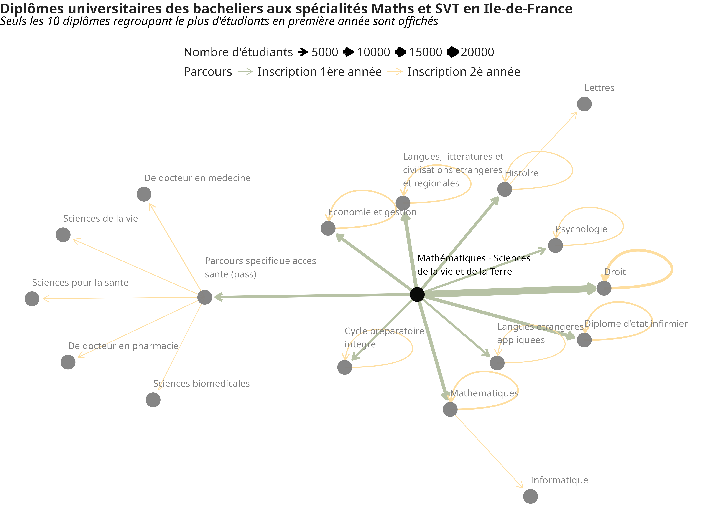
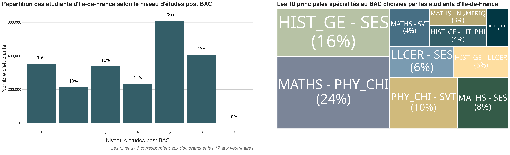

```{r setup, include=FALSE}
# Paramètres généraux
knitr::opts_chunk$set(
	eval = TRUE,
	echo = FALSE,
	fig.align = "center",
	fig.show = "hold",
	message = FALSE,
	warning = FALSE,
	collapse = TRUE,
	out.width = "100%",
	results = "asis"
)
```

```{r logo}
# Logo Datactivist haut de page
htmltools::img(src = "https://nextcloud.datactivist.coop/s/o53wzfMNnFosQni/preview", 
               alt = 'logo', 
               style = 'position:absolute; top:0; left:0.5; padding-top:10px;') #padding=taille des espaces autour
```

Les data-visualisations ont été construites sur les données [data.unif](https://data.unif.app/data/avril2024/Ile-de-France/) d'avril 2024 portant sur la **région Ile-de-France**.

## Datavisualisation n°2

Quelques précisions avant lecture du graphique ci-dessous : 

- les données affichées sont celles de toutes les cohortes composées d'au moins un étudiant ayant choisi la paire de spécialités au BAC ***"Mathématiques et SVT"*** (les données étant agrégées il n'est pas possible de filtrer uniquement sur les étudiants ayant choisi ces spécialités au BAC) ;
- par la suite, les formations année par année après le BAC ont été séparées et jointes avec les données *diplômes* des [référentiels ortho-typographiés](https://data.pages.unif.app/data-futures.html#r%C3%A9f%C3%A9rentiels-ortho-typographi%C3%A9s). Dans le cas de multi-inscriptions (séparées par le sigle '&'), seule la première inscription a été gardée ;
- le nombre d'étudiants a été sommé par parcours de formation d'une année à une autre (les données étant agrégées, c'est l'effectif de toute la cohorte qui a été sommé, pour le passage d'une formation A à une formation B, et l'effectif de toute la cohorte également, d'une formation B à une formation C) ;
- enfin, seuls les 10 parcours rassemblant le plus d'étudiants ont été affichés, pour garantir la lisibilité de la data-visualisation. 

<br>

<p align="center">



</p>

## Datavisualisation n°4 - 2/4

Quelques précisions avant lecture des graphiques ci-dessous : 

- les effectifs des 3 data-visualisations ont été multiplié par 1.14 pour réajuster la coupe des cohortes liée à l'anonymisation (pour rappel, les agrégats de moins de 5 personnes sont mis à 0 de manière à empêcher la réidentification des personnes). Pour les cohortes "coupées", c'est l'effectif 1.14 qui vient remplacer le 0, pour ces 3 graphiques ; 
- le **nombre d'année après le BAC** a été récupéré dans les données des cohortes, en récupérant pour chacune d'elle le niveau (premier caractère du codage des parcours) le plus élevé. Puis, la somme des effectifs a été calculée pour chaque degré maximal d'étude atteint (allant de 0 à 9) ;
- le **nombre de réorientations** a été calculé à partir des données des cohortes, en comptant le nombre de filières (diplômes) différents dans chaque cohorte (à partir de l'identifiant de formation). Le nombre de filières distinctes allant de 1 à 21, trois catégories ont été créées : 
    - *Filière unique* : c'est-à-dire par de réorientation ; 
    - *Deux filières* : c'est-à-dire 1 réorientation ; 
    - *Trois filières et plus* : c'est-à-dire au moins 2 réorientations.
- les **spécialités au BAC** ont été récupérées des données *cohorte_spe*, où ont été sommés les effectifs des étudiants par paire de spécialités. Seules les 10 paires les plus choisies par les étudiants ont été affichées sur le graphique.

<br>

<p align="center">



</p>

<p align="right">

{width="600"}

</p>

<div class = "tocify-extend-page" data-unique = "tocify-extend-page" style = "height: 0;"></div>
