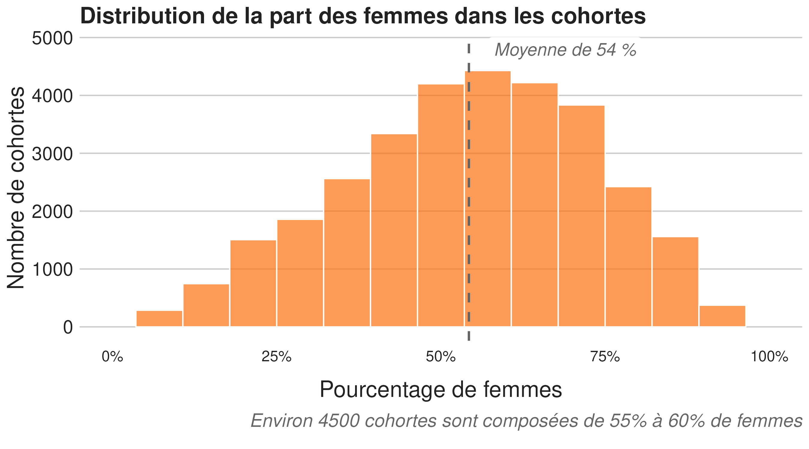

```{r setup, include=FALSE}
# Paramètres généraux
knitr::opts_chunk$set(
	eval = TRUE,
	echo = FALSE,
	fig.align = "center",
	fig.show = "hold",
	message = FALSE,
	warning = FALSE,
	collapse = TRUE,
	out.width = "100%",
	results = "asis"
)
```

```{r logo}
# Logo Datactivist haut de page
htmltools::img(src = "https://nextcloud.datactivist.coop/s/o53wzfMNnFosQni/preview", 
               alt = 'logo', 
               style = 'position:absolute; top:0; left:0.5; padding-top:10px;') #padding=taille des espaces autour
```


Les data-visualisations ont été construites sur les données [data.unif](https://data.unif.app/data/avril2024/France/) téléchargées le 3 avril 2024.

```{r import data et librairies}
library(tidyverse)
library(plotly)
library(flexdashboard)
library(icons)
library(gt)
library(rvest)
library(summarytools)

# Import données Oraccle
cohortes_age_premiereins <- read_delim("../data/Oraccle/cohorte_age_premiereins.csv", ",")
cohorte_anbac <- read_delim("../data/Oraccle/cohorte_anbac.csv", ",")
cohorte_bac <- read_delim("../data/Oraccle/cohorte_bac.csv", ",")
cohorte_derniereins <- read_delim("../data/Oraccle/cohorte_derniereins.csv", ",")
cohorte_premiereins <- read_delim("../data/Oraccle/cohorte_premiereins.csv", ",")
cohorte_sexe <- read_delim("../data/Oraccle/cohorte_sexe.csv", ",")
cohorte_spe <- read_delim("../data/Oraccle/cohorte_spe.csv", ",")
cohortes <- read_delim("../data/Oraccle/cohortes.csv", ",")
formations <- read_delim("../data/Oraccle/formations.csv", ",")

# Import données référentiels
academie <- read_csv("../data/Referentiels/n_academie_et_assimile_.csv", locale = locale(encoding = "ISO-8859-1"))
groupe_discipline <- read_csv("../data/Referentiels/n_groupe_discipline_sise_.csv", locale = locale(encoding = "ISO-8859-1"))
secteur_discipline <- read_csv("../data/Referentiels/n_secteur_disciplinaire_sise_.csv", locale = locale(encoding = "ISO-8859-1"))
discipline <- read_csv("../data/Referentiels/n_discipline_sise_.csv", locale = locale(encoding = "ISO-8859-1"))
diplome <- read_csv("../data/Referentiels/n_diplome_sise_.csv", locale = locale(encoding = "ISO-8859-1"))
type_diplome <- read_csv("../data/Referentiels/n_type_diplome_sise_.csv", locale = locale(encoding = "ISO-8859-1"))
etablissement <- read_delim("../data/Referentiels/organismes-2024-04-22.csv", ";")
```


```{r unnest cohortes}
## Cohortes
cohortes_unnest <- cohortes |> 
    select(-reussites) |> 
    mutate(parcours_annee = strsplit(as.character(trace), "\\+")) |> 
    unnest(parcours_annee) |> 
    mutate(parcours_annee = strsplit(as.character(parcours_annee), "&")) |> 
    unnest(parcours_annee) |> 
    mutate(formation = str_extract_all(parcours_annee, "(?<=-)([^-&]+)(?=-)"), #extract characters between - and -
           etablissement = str_extract_all(parcours_annee, "([^\\-]+)$")) #extract characters after last -
    #left_join(formations, join_by("parcours_annee" == "cohorte"))
```


# Statistiques exploratoires{.tabset}


```{r}
# Table
df <- data.frame(
    x = c(2, 8.5, 15, 21.5),
    y = rep(6.5, 4),
    h = rep(4.25, 4),
    w = rep(6.25, 4),
    value = c(nrow(cohortes), sum(cohortes$effectif), 3029, 17895),
    info = c("cohortes",
             "étudiants",
             "établissements",
             "formations"),
    color = factor(1:4)
)

# Graphique
ggplot(df, aes(x, y, height = h, width = w, label = info)) +
    ## Create the tiles using the `color` column
    geom_tile(aes(fill = color)) +
    ## Add the numeric values as text in `value` column
    geom_text(color = "white", fontface = "bold", size = 8,
              aes(label = ifelse(value > 999, format(as.integer(value, 0), nsmall = 1, big.mark = "."), value), 
                  x = x, y = y + 0.7), 
              hjust = c(.5, .5, .9, .8)) +
    ## Add the labels for each box stored in the `info` column
    geom_text(color = "white", fontface = "bold", size = 4,
              aes(label = info, x = x - 2.9, y = y - 1), hjust = 0) +
    coord_fixed() +
    #scale_fill_manual(type = "qual", palette = "Dark2") +
    scale_fill_manual(values = c("#fd710f", "#fe44d5", "#ede5e0", "#fb7564")) +
    ## Use `geom_text()` to add the icons by specifying the unicode symbol.
    theme_void() +
    guides(fill = FALSE) +
    theme(plot.margin = margin(-300, 0, -100, 0))
```


## cohorte_spe

```{r}
print(dfSummary(cohorte_spe, style = "grid", graph.magnif = 1, 
                valid.col = FALSE, varnumbers = FALSE, tmp.img.dir = "/tmp", 
                max.distinct.values = 5, headings = FALSE, method = "render"),
      max.tbl.height = 600,
      method = "render")
```


## cohorte_bac

```{r}
print(dfSummary(cohorte_bac, style = "grid", graph.magnif = 1, 
                valid.col = FALSE, varnumbers = FALSE, tmp.img.dir = "/tmp", 
                max.distinct.values = 5, headings = FALSE, method = "render"),
      max.tbl.height = 600,
      method = "render")
```


## cohorte_anbac

```{r}
print(dfSummary(cohorte_anbac, style = "grid", graph.magnif = 1, 
                valid.col = FALSE, varnumbers = FALSE, tmp.img.dir = "/tmp", 
                max.distinct.values = 5, headings = FALSE, method = "render"),
      max.tbl.height = 600, max.tbl.width = 200,
      method = "render")
```


## cohortes_age_premiereins

```{r}
print(dfSummary(cohortes_age_premiereins, style = "grid", graph.magnif = 1, 
                valid.col = FALSE, varnumbers = FALSE, tmp.img.dir = "/tmp", 
                max.distinct.values = 5, headings = FALSE, method = "render"),
      max.tbl.height = 600,
      method = "render")
```


## cohorte_premiereins

```{r}
print(dfSummary(cohorte_premiereins, style = "grid", graph.magnif = 1, 
                valid.col = FALSE, varnumbers = FALSE, tmp.img.dir = "/tmp", 
                max.distinct.values = 5, headings = FALSE, method = "render"),
      max.tbl.height = 600,
      method = "render")
```


## cohorte_derniereins

```{r}
print(dfSummary(cohorte_derniereins, style = "grid", graph.magnif = 1, 
                valid.col = FALSE, varnumbers = FALSE, tmp.img.dir = "/tmp", 
                max.distinct.values = 5, headings = FALSE, method = "render"),
      max.tbl.height = 600,
      method = "render")
```

## cohorte_sexe

```{r}
print(dfSummary(cohorte_sexe, style = "grid", graph.magnif = 1, 
                valid.col = FALSE, varnumbers = FALSE, tmp.img.dir = "/tmp", 
                max.distinct.values = 5, headings = FALSE, method = "render"),
      max.tbl.height = 600,
      method = "render")
```


# Visualisations exploratoires

<br>


<div align="center">
<iframe frameborder="0" width="800" height="600" src="../figures/distribution_annee_bac.html"></iframe>
</div>

<br>

<p align="center">
 
</p>


<br>

<div align="center">
<iframe frameborder="0" width="800" height="600" src="../figures/academie_plus_femmes.html"></iframe>
</div>


<div align="center">
<iframe frameborder="0" width="800" height="600" src="../figures/academie_moins_femmes.html"></iframe>
</div>


<div align="center">
<iframe frameborder="0" width="800" height="600" src="../figures/top10_specialites.html"></iframe>
</div>


<div align="center">
<iframe frameborder="0" width="800" height="600" src="../figures/disciplines_specialites.html"></iframe>
</div>


<div class = "tocify-extend-page" data-unique = "tocify-extend-page" style = "height: 0;"></div>


